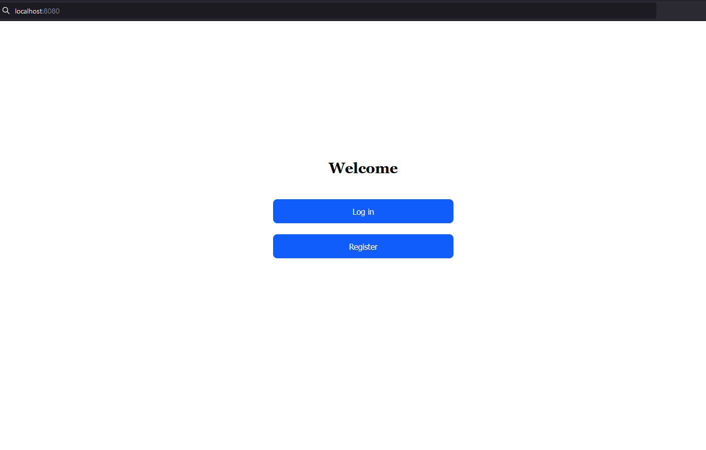
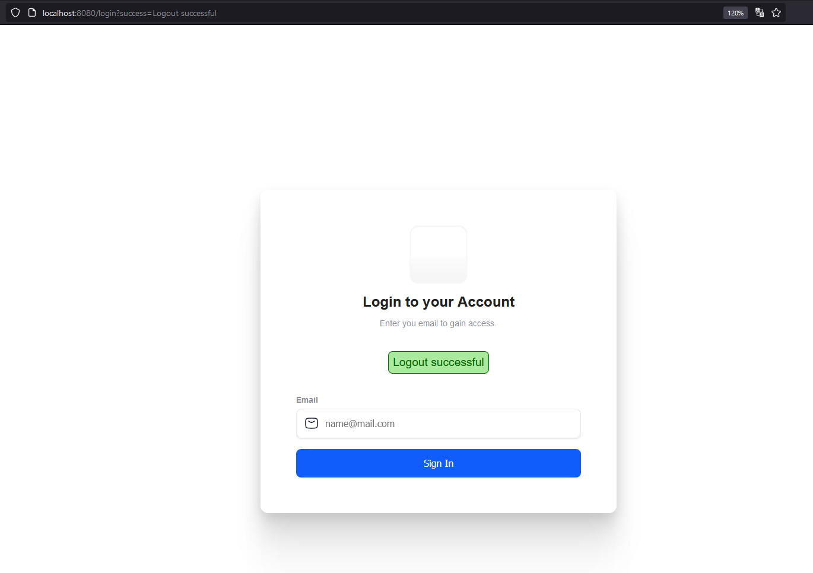
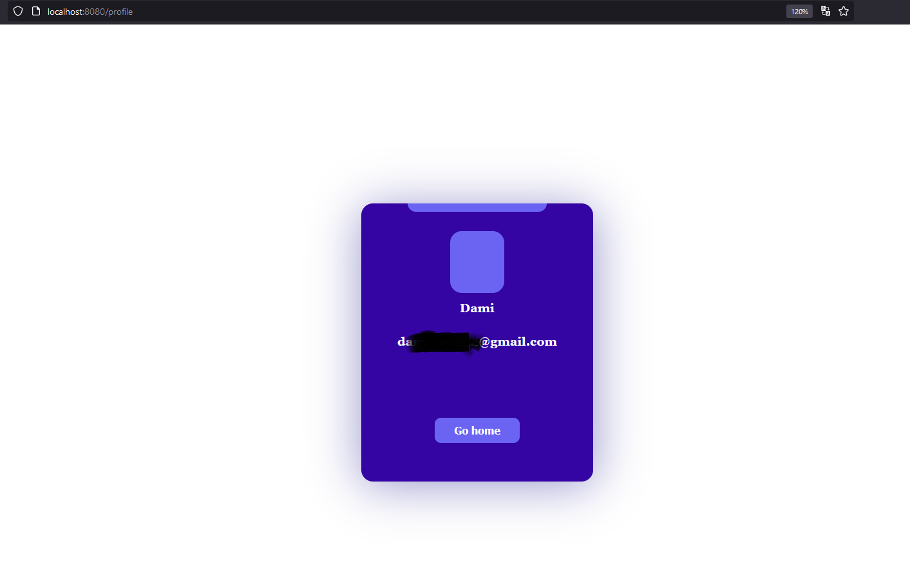

# Magic Link Authentication
Implementation of passwordless authentication using magic links. 
User provides their registered email at /login. 
An email with the authentication link is sent to the user.

# Pages
- Home - /
- Register - /register 
- Login - /login 
- Magic link - /login/*token 
- Profile - /profile

## Screenshots









# Modules
- Spring Web 
- Spring Security 
- Spring JPA - for database communication 
- Apache Derby - embedded database 
- Thymeleaf - template engine for views (resources/templates folder)

# Running the application
A jar file is provided in the /jar folder for convenience.
this can be run using:
```
#run with java
cd jar
java -jar magic-link-auth.jar
```
However, the project can be built and run on <b>intellij</b> or with maven directly:
```
#using maven on command line
mvn clean install -DskipTests
#jar file would be in target/ folder
```
### Requirement(s)
- Java 11
- Maven (optional)